# Lexxi - Plataforma Educativa

Aplicación educativa Flutter para quizzes interactivos y seguimiento de progreso académico.

## Descripción del Proyecto

Lexxi es una aplicación móvil desarrollada en Flutter que proporciona experiencias de aprendizaje interactivas mediante quizzes, contenido multimedia y seguimiento de progreso. La aplicación está construida siguiendo los principios de Clean Architecture con integración de servicios en la nube.

## 🚀 Inicio Rápido

### Configuración de Variables de Entorno

Crea un archivo `.env` en la raíz del proyecto con las siguientes variables:

```env
# API Principal
API_BASE_URL=https://tu-api-principal.com/api

# API Secundaria
API_BASE_URL_2=https://tu-api-secundaria.com

# URLs de Autenticación
AUTH_BASE_URL=https://tu-auth.com
AUTH_SAF_URL=https://tu-saf-auth.com
```

### Instalación

```bash
# 1. Instalar dependencias
flutter pub get

# 2. Generar código (inyección de dependencias y rutas)
flutter pub run build_runner build --delete-conflicting-outputs

# 3. Ejecutar la aplicación
flutter run
```

---

## 📋 Endpoints de la API

Para ver el listado completo de endpoints que usa la aplicación, consulta la documentación en la sección [Endpoints](#-endpoints-de-la-api-1) más abajo.

---

## Arquitectura del Proyecto

### Principios de Arquitectura
- **Clean Architecture**: Separación clara en capas (Domain, Application, Infrastructure, Presentation)
- **Inyección de Dependencias**: GetIt + Injectable
- **Gestión de Estado**: Provider pattern
- **Navegación**: Auto Route
- **Generación de Código**: Build Runner

## Diagramas del Sistema

### Diagrama de Dominio Completo
```mermaid
classDiagram
    %% ========================================
    %% AUTENTICACIÓN Y USUARIOS
    %% ========================================
    class User {
        +String id
        +String name
        +String email
        +String typeUser
        +List~Grado~ grados
        +String token
        +toJson() Map~String, dynamic~
        +fromJson(Map) User
        +isAuthenticated() bool
        +hasRole(String) bool
    }
    
    class LoginModel {
        +String email
        +String password
        +toJson() Map~String, dynamic~
        +isValid() bool
        +validateEmail() bool
        +validatePassword() bool
    }
    
    class RegisterModel {
        +String email
        +String password
        +String confirmPassword
        +Enroll enroll
        +toJson() Map~String, dynamic~
        +validate() ValidationResult
    }
    
    class Enroll {
        +String institutionId
        +String gradeId
        +DateTime enrollDate
        +String status
    }
    
    %% ========================================
    %% ESTUDIANTES Y ACADÉMICO
    %% ========================================
    class Student {
        +String idStudent
        +String nombre
        +String email
        +int totalScore
        +List~Grado~ grados
        +Config config
        +DateTime lastActivity
        +getGrado(String) Grado
        +getScoreBySubject(String) double
        +getCurrentLevel() Level
        +getOverallPerformance() Performance
        +updateProgress(ResultQuizModel) void
    }
    
    class Grado {
        +String grado
        +String idGrado
        +String descripcion
        +int scoreSimulacro
        +List~Asignatura~ asignaturas
        +List~HistoryTime~ historyTime
        +List~ProgressHistory~ progressHistory
        +obtenerMejorYPeorTiempo() TimeRange
        +calcularRankingResumen() RankingSummary
        +obtenerResumenUltimaSesion() SessionSummary
        +getCompletionPercentage() double
    }
    
    class Asignatura {
        +String asignaturaId
        +String asignatura
        +String descripcion
        +String currentColor
        +String level
        +double score
        +int questionsAnswered
        +int correctAnswers
        +DateTime lastUpdate
        +getAccuracy() double
        +getProgressStatus() ProgressStatus
    }
    
    class HistoryTime {
        +DateTime startTime
        +DateTime endTime
        +String sessionId
        +int questionsAnswered
        +getDuration() Duration
    }
    
    class ProgressHistory {
        +String sessionId
        +DateTime date
        +double scoreAchieved
        +String subjectId
        +int questionsTotal
        +int questionsCorrect
    }
    
    %% ========================================
    %% PREGUNTAS Y EVALUACIONES
    %% ========================================
    class Question {
        +String id
        +String pregtextov
        +String asignatura
        +String asignaturId
        +String pregcorrecta
        +String difficulty
        +List~Answer~ answers
        +ComponenteEducativo multimedia
        +List~String~ tags
        +getCorrectAnswer() Answer
        +isMultipleChoice() bool
        +validateAnswer(String) bool
        +getDifficultyLevel() DifficultyLevel
    }
    
    class Answer {
        +String id
        +String preguntaId
        +String resptextov
        +String responidentificadorv
        +bool isCorrect
        +String explanation
        +ComponenteEducativo multimedia
    }
    
    class DetallePregunta {
        +String id
        +String cod
        +String componente
        +String grado
        +String area
        +String asignatura
        +ComponenteEducativo pregunta
        +String respuestaCorrecta
        +String explicacion
        +List~String~ competencias
        +getDifficultyMetrics() DifficultyMetrics
    }
    
    class ComponenteEducativo {
        +String idRecurso
        +String tipoRecurso
        +String id
        +String componente
        +String url
        +Map~String, dynamic~ metadata
        +toFleather() String
        +isVideoContent() bool
        +isAudioContent() bool
        +isImageContent() bool
    }
    
    %% ========================================
    %% RESULTADOS Y EVALUACIÓN
    %% ========================================
    class ResultQuizModel {
        +String sessionId
        +bool isSimulacro
        +String rute
        +String respuestaCo
        +DateTime startTime
        +DateTime endTime
        +List~Respuesta~ respuestas
        +double finalScore
        +preguntasCorrectas() int
        +calcularPorcentajeRespuestasVerdaderas() double
        +calcularPorcentajeRespuestasCorrectasPorAsignatura() Map
        +calcularNotaFinal() double
        +getPerformanceAnalysis() PerformanceAnalysis
        +getDuration() Duration
    }
    
    class Respuesta {
        +String idPregunta
        +String asignatura
        +String idEstudiante
        +String idInstituto
        +String respuesta
        +String respuestaCorrecta
        +bool isCorrect
        +DateTime dateCreated
        +int timeSpent
        +validateResponse() bool
    }
    
    class PerformanceAnalysis {
        +Map~String, double~ subjectScores
        +List~String~ strongAreas
        +List~String~ weakAreas
        +List~String~ recommendations
        +double overallAccuracy
    }
    
    %% ========================================
    %% NIVELES Y PROGRESIÓN
    %% ========================================
    class AcademicLevelModel {
        +String idGrado
        +String gradeName
        +int levelMax
        +List~TypeLevel~ typesLevels
        +Map~String, int~ subjectWeights
        +compare(String puntaje) ComparisonResult
        +getNextLevel(double currentScore) Level
        +calculateProgress(double score) ProgressInfo
    }
    
    class TypeLevel {
        +String name
        +String description
        +String color
        +int min
        +int max
        +List~Level~ levels
        +String icon
        +List~String~ benefits
        +getColor() Color
        +findLevelByPuntaje(int) Level
        +getProgressToNext(int) double
    }
    
    class Level {
        +String level
        +String name
        +String description
        +int puntaje
        +String badge
        +List~String~ rewards
        +isAchieved(int currentScore) bool
    }
    
    %% ========================================
    %% CONFIGURACIÓN Y PROMOCIONES
    %% ========================================
    class Config {
        +String idStudent
        +NotificationConfig notification
        +Map~String, dynamic~ preferences
        +String theme
        +String language
        +bool soundEnabled
        +updatePreference(String, dynamic) void
    }
    
    class NotificationConfig {
        +bool enabled
        +List~String~ types
        +String frequency
        +Map~String, bool~ channels
    }
    
    class PromotionModel {
        +String id
        +String title
        +String description
        +String imageUrl
        +String fileUrl
        +DateTime startDate
        +DateTime endDate
        +String targetAudience
        +bool isActive
        +getActivePromotion() PromotionModel
        +isValidForUser(User) bool
    }
    
    %% ========================================
    %% RELACIONES ENTRE MÓDULOS
    %% ========================================
    
  
    
    %% Relaciones de Preguntas
    Question ||--o{ Answer : "tiene opciones"
    DetallePregunta ||--|| ComponenteEducativo : "contiene multimedia"
    Question ||--|| ComponenteEducativo : "puede tener multimedia"
    
    %% Relaciones de Resultados
    ResultQuizModel ||--o{ Respuesta : "contiene"
    Respuesta }o--|| Question : "responde a"
    Respuesta }o--|| Student : "creada por"
    ResultQuizModel ||--|| PerformanceAnalysis : "genera"
    
    %% Relaciones de Niveles
    AcademicLevelModel ||--o{ TypeLevel : "define tipos"
    TypeLevel ||--o{ Level : "contiene niveles"
    Student }o--o{ Level : "puede alcanzar"
    
    %% Relaciones de Configuración
    Config ||--|| NotificationConfig : "incluye"
    User }o--o{ PromotionModel : "puede recibir"
```

### Diagrama de Arquitectura Clean - Capas y Dependencias

```mermaid
classDiagram
    %% ========================================
    %% CAPA DE PRESENTACIÓN (UI & PROVIDERS)
    %% ========================================
    class DataUserProvider {
        +ValueNotifier~UserViewModel~ user
        +AuthService authService
        +updateUser(User) void
        +clearUser() void
        +getCurrentUser() User?
        +isAuthenticated() bool
    }
    
    class ResumenQuizProvider {
        +ResultQuizModel? resultQuiz
        +StudentService studentService
        +updateResult(ResultQuizModel) void
        +clearResult() void
        +getLastResult() ResultQuizModel?
    }
    
    class GradoProvider {
        +String? grado
        +String? idGrado
        +List~Asignatura~ asignaturas
        +setGrado(String, String) void
        +getCurrentGrado() String?
        +loadAsignaturas() Future~List~Asignatura~~
    }
    
    class StateAppBarProvider {
        +bool hidden
        +double height
        +Color backgroundColor
        +toggleVisibility() void
        +setHeight(double) void
        +resetState() void
    }
    
    class ThemeController {
        +ThemeMode themeMode
        +bool isDarkMode
        +Color primaryColor
        +changeTheme(ThemeMode) void
        +toggleDarkMode() void
        +updatePrimaryColor(Color) void
    }
    
    class QuizSessionProvider {
        +String? currentSessionId
        +int currentQuestionIndex
        +List~Question~ questions
        +Map~String, String~ answers
        +Timer? sessionTimer
        +startSession(List~Question~) void
        +submitAnswer(String, String) void
        +finishSession() ResultQuizModel
    }
    
    %% ========================================
    %% CAPA DE APLICACIÓN (USE CASES & SERVICES)
    %% ========================================
    class AuthService {
        -LoginRepository loginRepository
        -LocalstorageShared localStorage
        +execute(LoginModel) Future~Result~User~~
        +getUserLocal() Future~User?~
        +register(RegisterModel) Future~Result~User~~
        +logout() Future~void~
        +changePassword(String, String) Future~Result~bool~~
        +validateToken() Future~bool~
    }
    
    class StudentService {
        -StudentsRepositorie repository
        -AuthService authService
        +create(Student) Future~Result~Student~~
        +getInfo(String) Future~Result~Student~~
        +saveStudentResponse(ResultQuizModel) Future~Result~bool~~
        +config(Config) Future~Result~Config~~
        +update(Student) Future~Result~Student~~
        +getPosition(String) Future~Result~int~~
        +getStudentProgress(String) Future~ProgressReport~
    }
    
    class PreguntaService {
        -PreguntaRepository repository
        +getPreguntas(String asignatura) Future~List~Question~~
        +getPreguntasPorGrado(String grado) Future~List~Question~~
        +registrarPreguntaMala(String) Future~void~
        +getRandomQuestions(int count) Future~List~Question~~
        +validateAnswers(List~Respuesta~) Future~ResultQuizModel~
    }
    
    class AcademicLevelService {
        -AcademicLevelRepository repository
        +getLevelsForGrade(String) Future~AcademicLevelModel~
        +calculateStudentLevel(String, double) Future~Level~
        +getProgressToNextLevel(String, double) Future~double~
        +updateStudentProgress(String, double) Future~void~
    }
    
    class PromotionService {
        -PromotionRepository repository
        +getActivePromotions() Future~List~PromotionModel~~
        +getPromotionsForUser(String) Future~List~PromotionModel~~
        +markPromotionViewed(String) Future~void~
    }
    
    class NotificationService {
        -FirebaseMessaging messaging
        +initialize() Future~void~
        +subscribeToTopic(String) Future~void~
        +sendLocalNotification(String, String) Future~void~
        +scheduleReminder(DateTime, String) Future~void~
    }
    
    %% ========================================
    %% CAPA DE DOMINIO (INTERFACES & ENTITIES)
    %% ========================================
    class LoginRepository {
        <<interface>>
        +auth(LoginModel) Future~Result~User~~
        +getUserLocal() Future~User?~
        +getInfoUser(String) Future~Result~User~~
        +registerUser(RegisterModel) Future~Result~User~~
        +logout() Future~void~
        +changePassword(String, String) Future~Result~bool~~
    }
    
    class StudentsRepositorie {
        <<interface>>
        +getInfo(String) Future~Result~Student~~
        +update(Student) Future~Result~Student~~
        +create(Student) Future~Result~Student~~
        +config(Config) Future~Result~Config~~
        +getPosition(String) Future~Result~int~~
        +saveStudentResponse(ResultQuizModel) Future~Result~bool~~
    }
    
    class PreguntaRepository {
        <<interface>>
        +getPreguntas(String) Future~List~Question~~
        +getPreguntaPorAsignatura(String, String) Future~List~Question~~
        +getPreguntaPorGrado(String) Future~List~Question~~
        +registrarPreguntaMala(String) Future~void~
    }
    
    class AcademicLevelRepository {
        <<interface>>
        +getLevelsForGrade(String) Future~AcademicLevelModel~
        +updateStudentLevel(String, Level) Future~void~
        +getStudentCurrentLevel(String) Future~Level~
    }
    
    class PromotionRepository {
        <<interface>>
        +getActivePromotions() Future~List~PromotionModel~~
        +getPromotionById(String) Future~PromotionModel?~
        +markPromotionViewed(String, String) Future~void~
    }
    
    %% ========================================
    %% CAPA DE INFRAESTRUCTURA (IMPLEMENTATIONS)
    %% ========================================
    class UserImplement {
        -RemoteDataSource remoteDataSource
        -LocalstorageShared localStorage
        -ApiService apiService
        +auth(LoginModel) Future~Result~User~~
        +getUserLocal() Future~User?~
        +registerUser(RegisterModel) Future~Result~User~~
        +logout() Future~void~
        +getInfoUser(String) Future~Result~User~~
    }
    
    class StudentImplement {
        -ApiService apiService
        -LocalstorageShared localStorage
        +getInfo(String) Future~Result~Student~~
        +create(Student) Future~Result~Student~~
        +saveStudentResponse(ResultQuizModel) Future~Result~bool~~
        +config(Config) Future~Result~Config~~
        +update(Student) Future~Result~Student~~
        +getPosition(String) Future~Result~int~~
    }
    
    class PreguntaImplement {
        -ApiService apiService
        -FirebaseCrud firebaseCrud
        +getPreguntas(String) Future~List~Question~~
        +getPreguntaPorAsignatura(String, String) Future~List~Question~~
        +registrarPreguntaMala(String) Future~void~
    }
    
    class AcademicLevelImplement {
        -ApiService apiService
        -LocalstorageShared localStorage
        +getLevelsForGrade(String) Future~AcademicLevelModel~
        +updateStudentLevel(String, Level) Future~void~
        +getStudentCurrentLevel(String) Future~Level~
    }
    
    class PromotionImplement {
        -ApiService apiService
        -FirebaseCrud firebaseCrud
        +getActivePromotions() Future~List~PromotionModel~~
        +getPromotionById(String) Future~PromotionModel?~
        +markPromotionViewed(String, String) Future~void~
    }
    
    %% ========================================
    %% FUENTES DE DATOS (DATA SOURCES)
    %% ========================================
    class RemoteDataSource {
        -ApiService apiService
        +login(LoginModel) Future~Map~String, dynamic~~
        +register(RegisterModel) Future~Map~String, dynamic~~
        +getUserInfo(String) Future~Map~String, dynamic~~
        +updateUser(User) Future~Map~String, dynamic~~
    }
    
    class LocalstorageShared {
        -SharedPreferences preferences
        +saveUser(User) Future~void~
        +getUser() Future~User?~
        +removeUser() Future~void~
        +saveToken(String) Future~void~
        +getToken() Future~String?~
        +saveBool(String, bool) Future~void~
        +getBool(String) Future~bool~
    }
    
    class ApiService {
        -Dio dio
        -String baseUrl
        +get~T~(String, Map?) Future~Response~T~~
        +post~T~(String, Map?, Map?) Future~Response~T~~
        +put~T~(String, Map?, Map?) Future~Response~T~~
        +delete~T~(String, Map?) Future~Response~T~~
        +configureHeaders(Map~String, String~) void
        +setAuthToken(String) void
    }
    
    class FirebaseCrud {
        -FirebaseFirestore firestore
        +create(String, Map) Future~DocumentReference~
        +read(String, String) Future~DocumentSnapshot~
        +update(String, String, Map) Future~void~
        +delete(String, String) Future~void~
        +query(String, Map) Future~QuerySnapshot~
    }
    
    class FirebaseMessagingService {
        -FirebaseMessaging messaging
        +initialize() Future~void~
        +getToken() Future~String?~
        +subscribeToTopic(String) Future~void~
        +onMessage Stream~RemoteMessage~
        +onMessageOpenedApp Stream~RemoteMessage~
    }
    
    %% ========================================
    %% RELACIONES DE DEPENDENCIAS (CLEAN ARCHITECTURE)
    %% ========================================
    
    %% Presentación -> Aplicación
    DataUserProvider ..> AuthService : "usa"
    ResumenQuizProvider ..> StudentService : "usa"
    GradoProvider ..> PreguntaService : "usa"
    QuizSessionProvider ..> PreguntaService : "usa"
    
    %% Aplicación -> Dominio (Interfaces)
    AuthService ..> LoginRepository : "depende de"
    StudentService ..> StudentsRepositorie : "depende de"
    StudentService ..> AuthService : "usa"
    PreguntaService ..> PreguntaRepository : "depende de"
    AcademicLevelService ..> AcademicLevelRepository : "depende de"
    PromotionService ..> PromotionRepository : "depende de"
    
    %% Infraestructura -> Dominio (Implementaciones)
    UserImplement ..|> LoginRepository : "implementa"
    StudentImplement ..|> StudentsRepositorie : "implementa"
    PreguntaImplement ..|> PreguntaRepository : "implementa"
    AcademicLevelImplement ..|> AcademicLevelRepository : "implementa"
    PromotionImplement ..|> PromotionRepository : "implementa"
    
    %% Infraestructura -> Fuentes de Datos
    UserImplement ..> RemoteDataSource : "usa"
    UserImplement ..> LocalstorageShared : "usa"
    StudentImplement ..> ApiService : "usa"
    PreguntaImplement ..> ApiService : "usa"
    PreguntaImplement ..> FirebaseCrud : "usa"
    
    %% Servicios de Datos
    RemoteDataSource ..> ApiService : "usa"
    NotificationService ..> FirebaseMessagingService : "usa"
```


### Diagrama de Flujo Completo del Sistema Quiz
```mermaid
flowchart TD
    %% ========================================
    %% INICIO DEL PROCESO
    %% ========================================
    A[👤 Usuario Selecciona Quiz] --> B{🔐 Usuario Autenticado?}
    B -->|No| C[📱 Pantalla de Login]
    C --> D[🔑 AuthService.execute()]
    D --> E{✅ Login Exitoso?}
    E -->|No| C
    E -->|Sí| F[💾 Guardar Token & Usuario]
    
    B -->|Sí| G[🎯 Seleccionar Asignatura/Grado]
    F --> G
    
    %% ========================================
    %% CONFIGURACIÓN DEL QUIZ
    %% ========================================
    G --> H[🔄 PreguntaService.getPreguntas()]
    H --> I{📊 Preguntas Disponibles?}
    I -->|No| J[⚠️ Mostrar Mensaje de Error]
    I -->|Sí| K[🎲 Mezclar Preguntas]
    K --> L[⏰ Inicializar Timer]
    L --> M[📋 QuizSessionProvider.startSession()]
    
    %% ========================================
    %% EJECUCIÓN DEL QUIZ
    %% ========================================
    M --> N[📝 Mostrar Primera Pregunta]
    N --> O[👆 Usuario Selecciona Respuesta]
    O --> P[💾 QuizSessionProvider.submitAnswer()]
    P --> Q{❓ Más Preguntas?}
    
    Q -->|Sí| R[➡️ Siguiente Pregunta]
    R --> N
    
    Q -->|No| S[⏹️ Finalizar Quiz]
    S --> T[📊 QuizSessionProvider.finishSession()]
    
    %% ========================================
    %% PROCESAMIENTO DE RESULTADOS
    %% ========================================
    T --> U[🧮 Calcular Puntajes]
    U --> V[📈 Generar ResultQuizModel]
    V --> W[🔍 PerformanceAnalyzer.analyze()]
    W --> X[📋 Crear PerformanceReport]
    
    %% ========================================
    %% ALMACENAMIENTO Y ACTUALIZACIÓN
    %% ========================================
    X --> Y[💾 StudentService.saveStudentResponse()]
    Y --> Z[🏆 AcademicLevelService.updateProgress()]
    Z --> AA[📊 Actualizar Student.score]
    AA --> BB[🎯 Calcular Nuevo Level]
    BB --> CC{🆙 Subió de Nivel?}
    
    CC -->|Sí| DD[🎉 Mostrar Notificación de Logro]
    CC -->|No| EE[📱 Mostrar Resultados]
    DD --> EE
    
    %% ========================================
    %% ANÁLISIS Y RECOMENDACIONES
    %% ========================================
    EE --> FF[📈 Mostrar Estadísticas]
    FF --> GG[💡 Generar Recomendaciones]
    GG --> HH[📚 Sugerir Temas de Estudio]
    HH --> II[🏠 Volver a Home]
    
    %% ========================================
    %% FLUJOS ALTERNATIVOS
    %% ========================================
    O --> JJ{⏰ Tiempo Agotado?}
    JJ -->|Sí| KK[⏰ Auto-Submit Respuesta]
    KK --> Q
    JJ -->|No| P
    
    P --> LL{💾 Error al Guardar?}
    LL -->|Sí| MM[🔄 Reintentar Guardado]
    MM --> Q
    LL -->|No| Q
    
    %% ========================================
    %% ESTILOS
    %% ========================================
    classDef userAction fill:#e1f5fe,stroke:#01579b,stroke-width:2px
    classDef systemProcess fill:#f3e5f5,stroke:#4a148c,stroke-width:2px
    classDef dataProcess fill:#e8f5e8,stroke:#1b5e20,stroke-width:2px
    classDef decision fill:#fff3e0,stroke:#e65100,stroke-width:2px
    classDef error fill:#ffebee,stroke:#c62828,stroke-width:2px
    
    class A,C,G,N,O userAction
    class D,H,K,L,M,P,T,U,V,W,X,Y,Z,AA,BB systemProcess
    class F,S,DD,EE,FF,GG,HH dataProcess
    class B,E,I,Q,CC,JJ,LL decision
    class J,MM error
```

### Diagrama de Componentes del Sistema Quiz


### Diagrama de Vista General del Sistema

```mermaid
graph TB
    %% ========================================
    %% USUARIO Y DISPOSITIVOS
    %% ========================================
    subgraph "👥 USUARIOS"
        U1[📱 Estudiante Mobile]
        U2[💻 Estudiante Web]
        U3[👨‍🏫 Profesor/Admin]
    end

    %% ========================================
    %% APLICACIÓN FLUTTER
    %% ========================================
    subgraph "📱 APLICACIÓN FORMARTE"
        subgraph "🎨 Presentation Layer"
            P1[🏠 Home Screen]
            P2[🔐 Auth Screens]
            P3[📝 Quiz Screens]
            P4[📊 Results Screens]
            P5[👤 Profile Screens]
            P6[🎯 Progress Screens]
        end
        
        subgraph "🔧 State Management"
            S1[👤 User Provider]
            S2[📋 Quiz Provider]
            S3[🎯 Grade Provider]
            S4[🎨 Theme Provider]
            S5[📊 App State Provider]
        end
        
        subgraph "⚡ Application Layer"
            A1[🔐 Auth Service]
            A2[🎓 Student Service]
            A3[❓ Question Service]
            A4[📈 Level Service]
            A5[🎁 Promotion Service]
            A6[📢 Notification Service]
        end
        
        subgraph "🏗️ Infrastructure"
            I1[👤 User Repository Impl]
            I2[🎓 Student Repository Impl]
            I3[❓ Question Repository Impl]
            I4[📈 Level Repository Impl]
        end
    end

    %% ========================================
    %% FUENTES DE DATOS
    %% ========================================
    subgraph "💾 DATA SOURCES"
        subgraph "☁️ Remote Data"
            R1[🌐 REST API<br/>api.formarte.co]
            R2[🔥 Firebase Firestore]
            R3[📨 Firebase Messaging]
        end
        
        subgraph "📱 Local Data"
            L1[💾 SharedPreferences]
            L2[🗂️ Local Storage]
            L3[📦 SQLite Database]
        end
    end

    %% ========================================
    %% SERVICIOS EXTERNOS
    %% ========================================
    subgraph "🌐 SERVICIOS EXTERNOS"
        E1[🔥 Firebase Services<br/>Authentication<br/>Cloud Messaging<br/>Firestore]
        E2[📊 Analytics Services]
        E3[💬 WhatsApp Integration]
        E4[📧 Email Services]
    end

    %% ========================================
    %% BACKEND Y BASE DE DATOS
    %% ========================================
    subgraph "⚙️ BACKEND SERVICES"
        B1[🚀 Node.js API Server<br/>Express.js]
        B2[📊 Reports Microservice]
        B3[🔍 Question Management]
        B4[📈 Analytics Engine]
    end

    subgraph "🗄️ DATABASES"
        D1[(MongoDB<br/>Main Database)]
        D2[(Firebase<br/>Real-time Data)]
        D3[(Analytics<br/>Database)]
    end

    %% ========================================
    %% CONEXIONES PRINCIPALES
    %% ========================================
    
    %% Usuarios a App
    U1 --> P1
    U1 --> P2
    U1 --> P3
    U2 --> P1
    U3 --> P4

    %% UI a State Management
    P1 --> S1
    P2 --> S1
    P3 --> S2
    P4 --> S2
    P5 --> S1
    P6 --> S3

    %% State Management a Services
    S1 --> A1
    S2 --> A2
    S2 --> A3
    S3 --> A4
    S4 --> A5
    S5 --> A6

    %% Services a Infrastructure
    A1 --> I1
    A2 --> I2
    A3 --> I3
    A4 --> I4

    %% Infrastructure a Data Sources
    I1 --> R1
    I1 --> L1
    I2 --> R1
    I2 --> R2
    I3 --> R1
    I3 --> R2
    I4 --> L2

    %% Data Sources a Backend
    R1 --> B1
    R2 --> E1
    R3 --> E1

    %% Backend a Databases
    B1 --> D1
    B2 --> D1
    B3 --> D1
    B4 --> D3

    %% External Services
    R3 --> E1
    B1 --> E2
    A6 --> E3
    B2 --> E4

    %% Local Data Flow
    L1 --> L3
    L2 --> L3

    %% ========================================
    %% ESTILOS
    %% ========================================
    classDef userInterface fill:#e3f2fd,stroke:#1976d2,stroke-width:3px
    classDef stateManagement fill:#f3e5f5,stroke:#7b1fa2,stroke-width:2px
    classDef applicationLayer fill:#e8f5e8,stroke:#388e3c,stroke-width:2px
    classDef infrastructure fill:#fff3e0,stroke:#f57c00,stroke-width:2px
    classDef dataSource fill:#fce4ec,stroke:#c2185b,stroke-width:2px
    classDef external fill:#e0f2f1,stroke:#00796b,stroke-width:2px
    classDef backend fill:#e8eaf6,stroke:#3f51b5,stroke-width:2px
    classDef database fill:#ffebee,stroke:#d32f2f,stroke-width:2px

    class P1,P2,P3,P4,P5,P6 userInterface
    class S1,S2,S3,S4,S5 stateManagement
    class A1,A2,A3,A4,A5,A6 applicationLayer
    class I1,I2,I3,I4 infrastructure
    class R1,R2,R3,L1,L2,L3 dataSource
    class E1,E2,E3,E4 external
    class B1,B2,B3,B4 backend
    class D1,D2,D3 database
```


### Diagrama de Flujo de Datos del Sistema

```mermaid
sequenceDiagram
    participant U as 👤 Usuario
    participant UI as 📱 UI Layer
    participant P as 🔧 Provider
    participant S as ⚡ Service
    participant R as 🏗️ Repository
    participant API as 🌐 API
    participant DB as 🗄️ Database
    participant Firebase as 🔥 Firebase

    %% ========================================
    %% FLUJO DE AUTENTICACIÓN
    %% ========================================
    Note over U,Firebase: 🔐 Proceso de Autenticación
    U->>UI: 1. Ingresa credenciales
    UI->>P: 2. Actualizar estado login
    P->>S: 3. AuthService.execute(credentials)
    S->>R: 4. LoginRepository.auth()
    R->>API: 5. POST /auth/login
    API->>DB: 6. Validar credenciales
    DB-->>API: 7. Usuario válido
    API-->>R: 8. Token + User data
    R-->>S: 9. Result<User>
    S->>Firebase: 10. Actualizar estado Firebase
    Firebase-->>S: 11. Token FCM
    S-->>P: 12. Usuario autenticado
    P-->>UI: 13. Navegar a Home
    UI-->>U: 14. Mostrar pantalla principal

    %% ========================================
    %% FLUJO DE QUIZ
    %% ========================================
    Note over U,Firebase: 📝 Proceso de Quiz
    U->>UI: 15. Selecciona quiz
    UI->>P: 16. Inicializar quiz
    P->>S: 17. PreguntaService.getPreguntas()
    S->>R: 18. PreguntaRepository.getPreguntas()
    R->>API: 19. GET /questions/{subject}
    API->>DB: 20. Consultar preguntas
    DB-->>API: 21. Lista de preguntas
    API-->>R: 22. Questions[]
    R-->>S: 23. List<Question>
    S-->>P: 24. Preguntas cargadas
    P-->>UI: 25. Mostrar primera pregunta

    U->>UI: 26. Responde pregunta
    UI->>P: 27. Registrar respuesta
    P->>P: 28. Validar y calcular

    Note over P: 📊 Al finalizar quiz
    P->>S: 29. StudentService.saveResponse()
    S->>R: 30. StudentsRepository.saveResponse()
    R->>API: 31. POST /students/{id}/responses
    API->>DB: 32. Guardar resultados
    
    par Actualización en paralelo
        API->>DB: 33a. Actualizar progreso
        and
        S->>Firebase: 33b. Sincronizar logros
    end

    DB-->>API: 34. Confirmación guardado
    Firebase-->>S: 35. Logros actualizados
    API-->>R: 36. Resultado guardado
    R-->>S: 37. Success
    S-->>P: 38. Progreso actualizado
    P-->>UI: 39. Mostrar resultados
    UI-->>U: 40. Pantalla de resultados

    %% ========================================
    %% NOTIFICACIONES Y SINCRONIZACIÓN
    %% ========================================
    Note over U,Firebase: 📢 Sistema de Notificaciones
    Firebase->>S: 41. Push notification
    S->>P: 42. Actualizar estado app
    P->>UI: 43. Mostrar notificación
    UI->>U: 44. Notificación visible

    %% ========================================
    %% SINCRONIZACIÓN OFFLINE
    %% ========================================
    Note over UI,Firebase: 💾 Manejo Offline/Online
    alt Conexión disponible
        UI->>API: Sincronizar datos
        API->>Firebase: Backup en tiempo real
    else Sin conexión
        UI->>P: Guardar localmente
        P->>R: LocalStorage
    end
```


## Estructura de Carpetas

### Directorio Raíz
```
formarte_app/
├── README.md                     # Documentación del proyecto
├── CLAUDE.md                     # Documentación específica para Claude
├── pubspec.yaml                  # Dependencias y configuración de Flutter
├── pubspec.lock                  # Archivo de bloqueo de dependencias
├── analysis_options.yaml         # Configuración de análisis estático
├── firebase.json                 # Configuración del proyecto Firebase
├── devtools_options.yaml         # Configuración de Flutter DevTools
├── firebase_options.dart         # Opciones de Firebase auto-generadas
├── lib/                          # Código fuente principal
├── assets/                       # Recursos estáticos
├── android/                      # Plataforma Android
├── ios/                          # Plataforma iOS
├── web/                          # Plataforma Web
├── test/                         # Pruebas unitarias
├── linux/                       # Plataforma Linux
├── macos/                        # Plataforma macOS
└── windows/                      # Plataforma Windows
```

### Directorio Principal (/lib)

#### Archivos de Configuración
```
lib/
├── main.dart                     # Punto de entrada de la aplicación
├── injection.dart                # Configuración de inyección de dependencias
├── injection.config.dart         # Configuración DI auto-generada
├── firebase_options.dart         # Configuración de Firebase
└── utils/                        # Funciones utilitarias
    ├── html_content_parser.dart  # Utilidades para parsing HTML
    ├── loogers_custom.dart       # Implementación de logging personalizado
    └── whatsapp.dart             # Integración con WhatsApp
```

#### 1. Capa de Dominio (/lib/domain)
**Propósito**: Contiene la lógica de negocio, entidades e interfaces de repositorios

```
domain/
├── academic_level/               # Niveles académicos
│   ├── model/
│   │   └── academic_level.dart
│   └── repository/
│       └── academic_level_repository.dart
├── asignaturas/                  # Gestión de materias
│   ├── model/
│   │   ├── asignatura_model.dart
│   │   └── resultado_asignatura.dart
│   └── repositories/
├── auth/                         # Autenticación
│   ├── exeptions/
│   │   └── user_exception.dart
│   ├── model/
│   │   ├── login_model.dart
│   │   ├── recordatorio_personalizado.dart
│   │   ├── register_model.dart
│   │   └── user.dart
│   └── repositories/
├── componente_educativo/         # Componentes educativos
├── detalle_pregunta/            # Detalles de preguntas
│   ├── model/
│   │   └── pregunta.dart
│   └── repository/
├── item_dynamic/                # Elementos dinámicos
├── level/                       # Gestión de niveles
├── pregunta/                    # Dominio de preguntas
│   ├── exeptions/
│   ├── models/
│   └── repositories/
├── promotion/                   # Promociones de usuarios
├── quiz/                        # Funcionalidad de quizzes
│   ├── model/
│   │   └── result_quiz_model.dart
│   └── repositories/
└── student/                     # Gestión de estudiantes
    ├── model/
    │   ├── resltado_pregunta.dart
    │   └── student.dart
    └── repositorie/
```

#### 2. Capa de Aplicación (/lib/aplication)
**Propósito**: Contiene casos de uso y lógica de servicios

```
aplication/
├── academic_level/
│   └── academic_level_use_case.dart
├── asignatura/
│   └── service/
│       └── asignatura_service.dart
├── auth/
│   ├── service/
│   │   └── auth_service.dart
│   └── use_case/
│       └── login_use_case.dart
├── componente_educativo/
├── detail_preguntas/
├── item_dynamic/
├── level/
├── pregunta/
│   └── service/
│       └── pregunta_service.dart
├── promotion/
└── student/
    └── student_service.dart
```

#### 3. Capa de Infraestructura (/lib/infrastructure)
**Propósito**: Implementaciones concretas de repositorios e integraciones de servicios externos

```
infrastructure/
├── academic_level/
│   └── academic_level_implement.dart
├── api_service/
│   └── api_service.dart          # Configuración principal del servicio API
├── asignatura/
│   └── signatura_implement.dart
├── auth/
│   ├── data_sources/
│   │   ├── local_data_source/
│   │   │   └── localstorage_shared.dart
│   │   └── remote_data_source.dart
│   └── repositories/
│       └── user_implement.dart
├── componente_educativo/
├── configs/
│   └── end_poins.dart           # Configuración de endpoints API
├── db/                          # Capa de base de datos
├── detalle_preguntas/
├── firebase/
│   └── firebase_crud.dart       # Operaciones CRUD de Firebase
├── item/
├── level/
├── promotion/
└── student/
    └── repositories/
        └── student_implement.dart
```

#### 4. Capa de Presentación (/lib/src)
**Propósito**: Componentes UI, páginas y lógica de presentación

```
src/
├── global/                      # Utilidades y componentes globales
│   ├── controllers/
│   │   └── theme_controller.dart
│   ├── extensions/
│   │   └── build_context_ext.dart
│   ├── messaging/
│   │   └── firebase_messaging_service.dart
│   ├── models/
│   │   ├── auth/
│   │   │   └── userViewModel.dart
│   │   └── whatsapp/
│   │       └── whats_app_message.dart
│   ├── utils/
│   │   └── change_colors.dart
│   ├── widgets/                 # Componentes UI reutilizables
│   │   ├── animationrive2.dart  # Animaciones Rive
│   │   ├── back_buttom.dart
│   │   ├── body_custom.dart
│   │   ├── circles_level.dart
│   │   ├── container_page/
│   │   ├── custom_popup.dart
│   │   ├── gradient_button.dart
│   │   ├── medal_*.dart         # Componentes de medallas
│   │   ├── rounded_*.dart       # Componentes de formulario
│   │   └── video_alert_dialog.dart
│   ├── colors_custom.dart       # Definiciones de colores personalizados
│   ├── device_size.dart         # Utilidades de diseño responsivo
│   ├── string.dart             # Constantes de strings
│   ├── text_axample.dart       # Ejemplos de estilos de texto
│   └── theme.dart              # Configuración del tema de la app
├── pages/                      # Pantallas de la aplicación
│   ├── auth/                   # Autenticación
│   │   ├── login/
│   │   └── signup/
│   ├── home/                   # Pantalla principal
│   │   ├── home.dart
│   │   └── widgets/
│   ├── profile/                # Perfil de usuario
│   │   ├── profile.dart
│   │   ├── sub_page/
│   │   └── widgets/
│   ├── quiz/                   # Funcionalidad de quizzes
│   │   ├── quiz.dart
│   │   └── widgets/
│   ├── result_view/            # Vista de resultados
│   ├── selected_programs/      # Selección de programas
│   ├── simulacrum/            # Simulacros
│   └── splash/                # Pantalla de carga
├── providers/                  # Providers de gestión de estado
│   ├── data_user_provider.dart
│   ├── grado_provider.dart
│   ├── resumen_quiz_provider.dart
│   └── state_app_bar_provider.dart
└── routes/                     # Configuración de navegación
    ├── routes.dart
    ├── routes_import.dart
    └── routes_import.gr.dart   # Rutas auto-generadas
```

### Directorio de Assets (/assets)
**Propósito**: Contiene recursos estáticos como imágenes, animaciones y videos

```
assets/
├── *.png                       # Archivos de imagen (logos, iconos, gráficos)
├── *.svg                       # Gráficos vectoriales
├── *.riv                       # Archivos de animación Rive
├── svg/                        # Archivos SVG adicionales
└── videos/                     # Assets de video
    └── Calendario-B2025_1.mp4
```

**Tipos de assets principales**:
- **Logos**: logo_blanco.png, LOGO2.png
- **Iconos**: Varios archivos iconos2-*.svg
- **Animaciones**: medalla_formarte.riv, medallon_degradado.riv
- **Gráficos**: astronauta.png, antorcha.png

### Directorios Específicos por Plataforma

#### Android (/android)
```
android/
├── app/
│   ├── build.gradle            # Configuración de build Android
│   ├── google-services.json    # Configuración Firebase Android
│   ├── formarte.jks           # Keystore de firmado
│   └── src/main/AndroidManifest.xml
├── build.gradle               # Configuración de build a nivel proyecto
├── gradle/                    # Gradle wrapper
├── key.properties            # Configuración de firmado
└── settings.gradle           # Configuración del proyecto
```

#### iOS (/ios)
```
ios/
├── Runner.xcodeproj/          # Proyecto Xcode
├── Runner.xcworkspace/        # Workspace Xcode
├── Runner/
│   ├── AppDelegate.swift      # App delegate iOS
│   ├── Assets.xcassets/       # Assets iOS
│   ├── GoogleService-Info.plist # Configuración Firebase iOS
│   └── Info.plist            # Configuración de la app iOS
├── Podfile                   # Dependencias CocoaPods
└── Podfile.lock             # Archivo de bloqueo CocoaPods
```

#### Web (/web)
```
web/
├── favicon.png               # Favicon web
├── icons/                    # Iconos PWA
├── index.html               # Punto de entrada web
└── manifest.json            # Manifiesto PWA
```

### Directorio de Pruebas (/test)
```
test/
└── widget_test.dart            # Pruebas básicas de widgets
```

## Comandos de Desarrollo

### Generación de Código (Requerido para desarrollo)
```bash
# Comando principal - ejecutar durante desarrollo
flutter pub run build_runner watch --delete-conflicting-outputs

# Comandos alternativos
dart run build_runner watch
flutter packages pub run build_runner watch
```

### Comandos Flutter Estándar
```bash
flutter pub get                    # Instalar dependencias
flutter run                       # Ejecutar la app en modo debug
flutter build apk                 # Build de release Android
flutter build ios                 # Build de release iOS
flutter test                      # Ejecutar todas las pruebas
flutter analyze                   # Ejecutar análisis estático
```

## Tecnologías Clave

### Framework Principal
- **Flutter SDK**: >=3.2.3 <4.0.0
- **Provider**: Gestión de estado
- **Auto Route**: Navegación y enrutamiento
- **GetIt + Injectable**: Inyección de dependencias

### Backend y Datos
- **Firebase**: Core, Firestore, Messaging
- **HTTP**: Comunicación API con manejo personalizado de certificados
- **Shared Preferences**: Almacenamiento local
- **JWT Decode**: Tokens de autenticación

### UI y Experiencia de Usuario
- **Sizer**: Diseño responsivo
- **Google Fonts**: Tipografía
- **Rive**: Animaciones interactivas y medallas
- **Video Player**: Contenido de video educativo
- **Audio Players**: Reproducción de contenido de audio
- **Flutter TeX**: Renderizado de expresiones matemáticas
- **Flutter HTML**: Renderizado de contenido HTML

## 🔌 Endpoints de la API

### Variables de Entorno Requeridas

La aplicación utiliza las siguientes variables de entorno para configurar los endpoints:

| Variable | Descripción | Ejemplo |
|----------|-------------|---------|
| `API_BASE_URL` | URL base de la API principal | `https://api.example.com/api` |
| `API_BASE_URL_2` | URL base de la API secundaria | `https://api2.example.com` |
| `AUTH_BASE_URL` | URL base de autenticación principal | `https://auth.example.com` |
| `AUTH_SAF_URL` | URL base de autenticación SAF | `https://saf-auth.example.com` |

---

### 🔐 Endpoints de Autenticación

**Base URLs:** `AUTH_BASE_URL` y `AUTH_SAF_URL`

| Método | Endpoint | Descripción | Parámetros |
|--------|----------|-------------|------------|
| POST | `/users/register` | Registro de usuario | `email`, `password`, `enroll` |
| POST | `/users/login/` | Login principal | `email`, `password` |
| POST | `/auth/login` | Login SAF (alternativo) | `email`, `password` |
| GET | `/user/{id}` | Obtener datos de usuario | `id` (path param) |
| GET | `/module/enrolls/student/{idS}` | Obtener matrículas | `idS` (path param) |
| POST | `/auth/change-password` | Cambiar contraseña | `current_password`, `new_password` |
| GET | `/user/profile/` | Obtener perfil | Header: `Authorization: Bearer {token}` |

---

### 📚 Endpoints API Principal

**Base URL:** `API_BASE_URL`

#### CRUD Genérico

| Método | Endpoint | Descripción | Body/Params |
|--------|----------|-------------|-------------|
| POST | `/{collection}` | Crear documento | `{"data": {...}}` |
| POST | `/{collection}/{id}` | Crear con ID específico | `{...}` |
| GET | `/{collection}` | Obtener todos | - |
| GET | `/{collection}/{id}` | Obtener por ID | - |
| PUT | `/{collection}/{id}` | Actualizar | `{...}` |
| DELETE | `/{collection}/{id}` | Eliminar | - |

#### Búsquedas

| Método | Endpoint | Descripción | Params |
|--------|----------|-------------|--------|
| GET | `/{collection}/category/{category}` | Buscar por categoría | `category` |
| GET | `/{collection}/search/{field}/{value}` | Buscar por campo | `field`, `value` |
| GET | `/{collection}/multi-search/{query}?fields={fields}` | Búsqueda multi-campo | `query`, `fields` (comma-separated) |

---

### 🎓 Endpoints por Módulo

#### Estudiantes (`/Estudiantes`)

| Método | Endpoint | Descripción |
|--------|----------|-------------|
| POST | `/Estudiantes/{id}` | Crear estudiante |
| POST | `/resultados_preguntas` | Guardar respuesta |
| POST | `/contadores_preguntas/{id}` | Crear contador de respuestas |
| POST | `/grado_dificultad/{id}` | Registrar dificultad de pregunta |
| PUT | `/Estudiantes/{id}` | Actualizar estudiante |
| GET | `/Estudiantes/convert_id/{id}` | Obtener info estudiante |
| PUT | `/Estudiantes/{id}/config` | Actualizar configuración |
| GET | `/get-my-position/{grado}/{id}` | Obtener posición en ranking |

#### Preguntas (`/detail_preguntas`)

| Método | Endpoint | Descripción |
|--------|----------|-------------|
| POST | `/detail_preguntas` | Crear pregunta |
| POST | `/detail_preguntas/{id}` | Crear con ID específico |
| GET | `/detail_preguntas` | Listar todas las preguntas |
| GET | `/detail_preguntas/{id}` | Obtener pregunta por ID |
| PUT | `/detail_preguntas/{id}` | Actualizar pregunta |

#### Items Dinámicos

| Método | Endpoint | Descripción |
|--------|----------|-------------|
| POST | `/{collection}` | Crear item |
| GET | `/generate-simulacro/{grado}/{cantidad}` | Generar simulacro |
| POST | `/{collection}` | Búsqueda bulk por IDs (body: `{"ids": [...], "grado": "..."}`) |

#### Niveles Académicos

| Método | Endpoint | Descripción |
|--------|----------|-------------|
| GET | `/academic_levels/{id}` | Obtener nivel por ID |
| GET | `/academic_levels/{id}/{score}` | Obtener nivel por puntaje |

#### Promociones

| Método | Endpoint | Descripción |
|--------|----------|-------------|
| GET | `/promotion_alert` | Obtener promociones activas |

---

### 🌐 Endpoints API Secundaria

**Base URL:** `API_BASE_URL_2`

| Método | Endpoint | Descripción |
|--------|----------|-------------|
| GET | `/module/programs/` | Obtener programas disponibles |
| GET | `/{endPoint}` | Obtener estados y ciudades (endpoint dinámico) |

---

### 🖼️ Endpoints de Imágenes

**Base URL:** `https://app.formarte.co/images` (hardcoded)

| Método | Endpoint | Descripción | Content-Type |
|--------|----------|-------------|--------------|
| POST | `/upload` | Subir imagen (multipart) | `multipart/form-data` |
| POST | `/upload` | Subir imagen (base64) | `application/json` (body: `{"image": "base64string"}`) |

---

### 📦 Colecciones Principales

- `Estudiantes` - Datos de estudiantes
- `resultados_preguntas` - Respuestas de estudiantes
- `contadores_preguntas` - Contadores de respuestas correctas/incorrectas
- `grado_dificultad` - Nivel de dificultad de preguntas
- `detail_preguntas` - Detalles de preguntas
- `academic_levels` - Niveles académicos
- `promotion_alert` - Alertas de promociones

---

## Configuración y Setup

### Integración de Servicios
- Zona Horaria: America/Bogota
- Manejo de imágenes: Multipart y Base64
- Autenticación: JWT Bearer Tokens

## Patrones de Desarrollo Comunes

### Agregar Nuevas Funcionalidades
1. Crear entidades de dominio e interfaces de repositorio
2. Implementar casos de uso en la capa de aplicación
3. Crear implementaciones de infraestructura
4. Construir componentes UI y providers
5. Registrar dependencias en la configuración de inyección
6. Ejecutar build runner para generar código

### Trabajar con Rutas
- Las rutas se auto-generan via Auto Route
- Configuración en `/lib/src/routes/`
- Ejecutar build runner después de cambios en rutas

### Gestión de Estado
- Usar Provider para estado de UI
- Crear providers en `/lib/src/providers/`
- Registrar en la configuración MultiProvider en main.dart